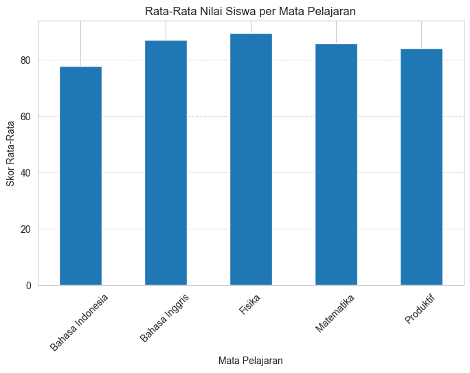
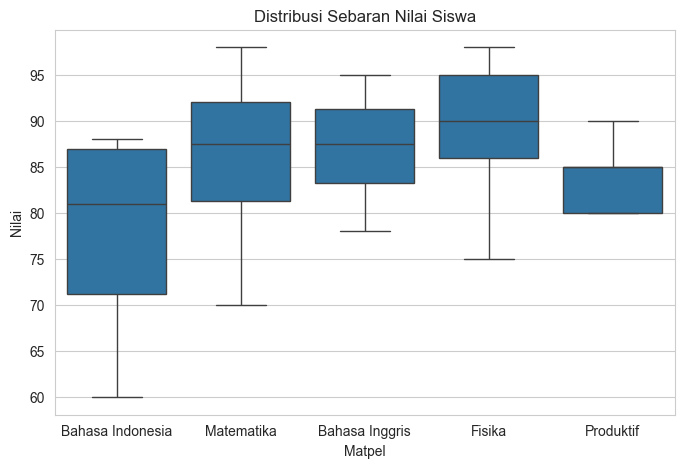

# Proyek Analisis Nilai Siswa

## 1. Ringkasan Proyek
Proyek ini bertujuan untuk menganalisis dataset nilai siswa yang disimpan dalam format CSV (`nilai_siswa.csv`). Analisis dilakukan untuk memahami performa akademik siswa secara keseluruhan maupun per mata pelajaran, serta mengidentifikasi pola distribusi nilai melalui visualisasi data.

## 2. Hasil Analisis Data
Berdasarkan pengolahan data pada `analisis.ipynb`, berikut adalah temuan utamanya:

### Statistik Keseluruhan
- **Rata-rata Nilai:** 85.07
- **Nilai Tengah (Median):** 86.5
- **Modus:** 90 (Nilai yang paling sering muncul)

### Statistik Per Mata Pelajaran
| Mata Pelajaran | Nilai Tertinggi | Nilai Terendah | Rata-rata |
|--- |--- |--- |--- |
| Bahasa Indonesia | 88 | 60 | 77.83 |
| Bahasa Inggris | 95 | 78 | 87.00 |
| Fisika | 98 | 75 | 89.33 |
| Matematika | 98 | 70 | 85.75 |
| Produktif | 90 | 80 | 84.00 |

## 3. Refleksi Pembelajaran
Dari analisis ini, dapat disimpulkan bahwa:
- Mata pelajaran **Fisika** memiliki rata-rata tertinggi (89.33), menunjukkan performa siswa yang sangat baik di bidang ini.
- Mata pelajaran **Bahasa Indonesia** memiliki rentang nilai yang cukup lebar dengan nilai terendah mencapai 60, yang menandakan perlunya perhatian lebih pada subjek tersebut.
- Penggunaan visualisasi seperti *boxplot* sangat membantu dalam melihat pencilan (*outliers*) dan variansi nilai antar mata pelajaran secara cepat.

## 4. Alat dan Pustaka yang Digunakan
- **Bahasa Pemrograman:** Python
- **Pustaka (Libraries):**
  - `pandas`: Untuk manipulasi dan analisis data tabel.
  - `matplotlib.pyplot`: Untuk pembuatan grafik dasar.
  - `seaborn`: Untuk visualisasi data statistik yang lebih menarik dan informatif.
- **Lingkungan:** Jupyter Notebook (.ipynb)

## 5. Output Visualisasi

### Perbandingan Rata-Rata Nilai
Visualisasi ini membandingkan performa rata-rata antar mata pelajaran.

### Distribusi dan Sebaran Nilai
Visualisasi ini menunjukkan sebaran nilai dan variansi pada setiap mata pelajaran.

